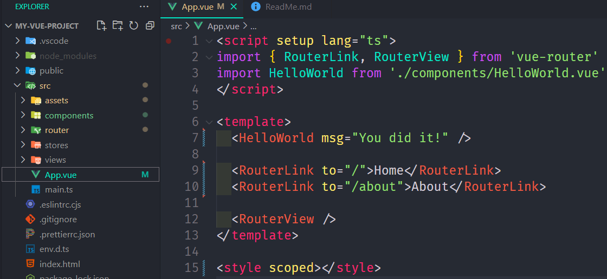
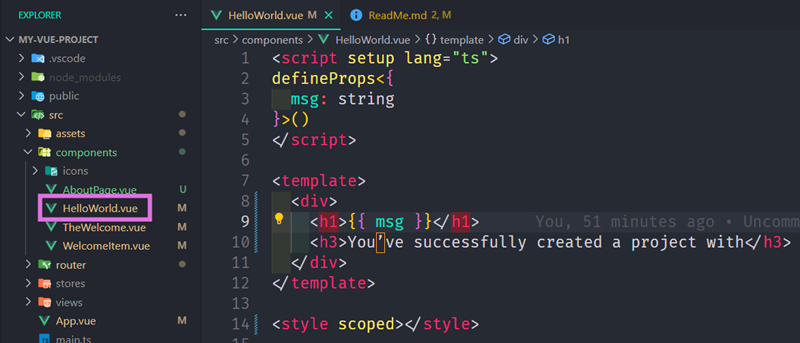
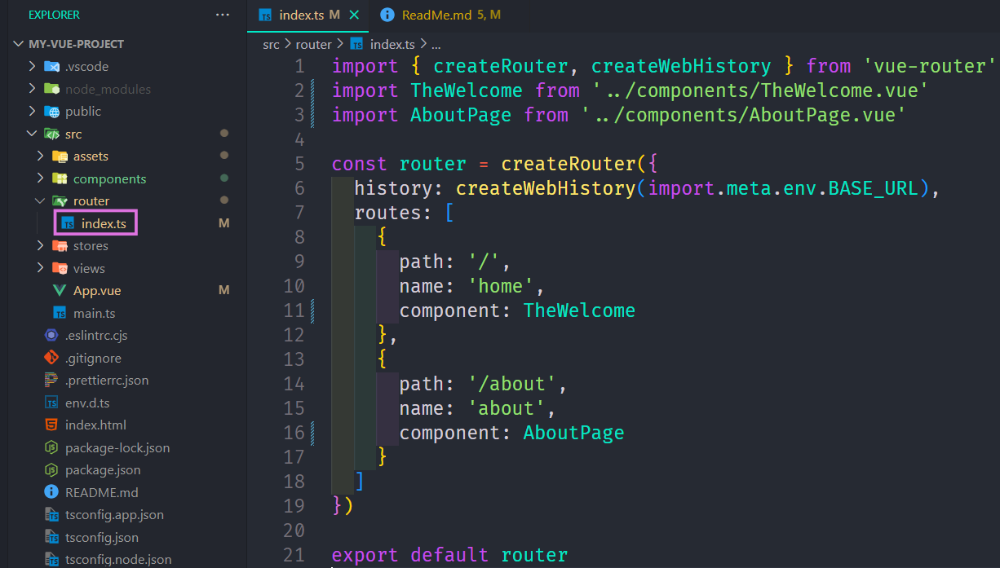
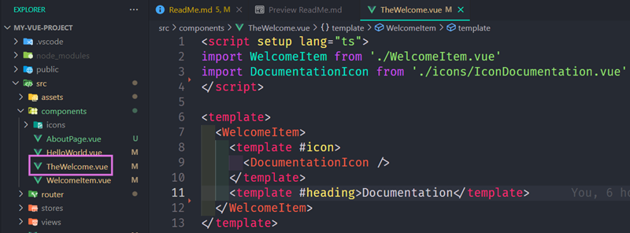
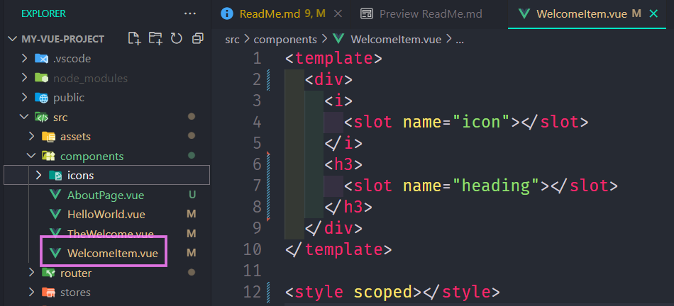

# 07 - Moving to a Better Development Setup & Workflow with the Vue CLI

## 005 Installing & Using the Vue CLI

when we are here now, the "Vue CLI" warns that:

"Vue CLI is in Maintenance Mode!

For new projects, please use create-vue to scaffold Vite-based projects. Also refer to the Vue 3 Tooling Guide for the latest recommendations."

so we use "npm create vue@latest"

